# 2024 Jan 18

## Update

_Got SDSS-V data_ — I got access to the sloan-25mlog mailing list, and I wrote a Python script that logs in, downloads a month's logs, and scrapes them for the frame numbers of all BOSS arcs and flats from the month. Then, I have another script to use these frame numbers to download all the raw arcs and flats. So far, I've downloaded December and November 2023. This gives me 1,774 arcs, which I've split 80/10/10 into train/val/test sets. Note that I'm grabbing the red and blue cameras as separate images, so really there's only 887 exposures, but I'm letting the network learn on both simultaneously.

_Explored much smaller latent spaces_ — I trained networks down to a latent dimensionality of 1. A summary of the training curves is shown below.

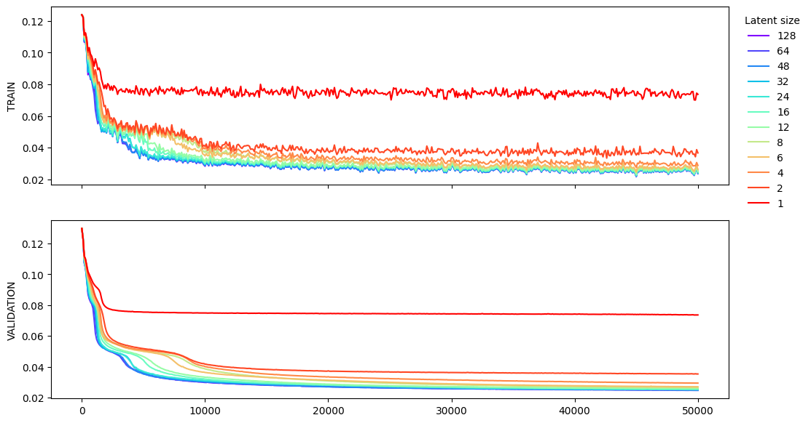
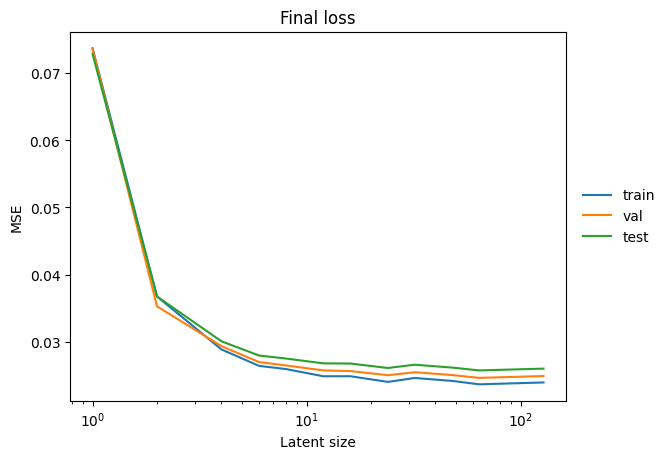

I'm really interested by the performance of $\ell = 2$, since it seems to cross some threshold that $\ell = 1$ can't, even though it can't perform quite as well as the higher dimensionalities.

Here's a comparison of the reconstructions for different, small latent sizes on some randomly chosen examples.

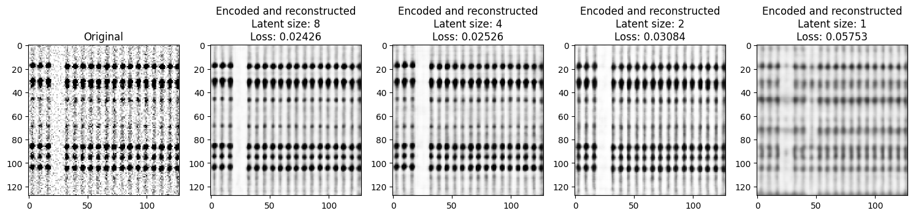
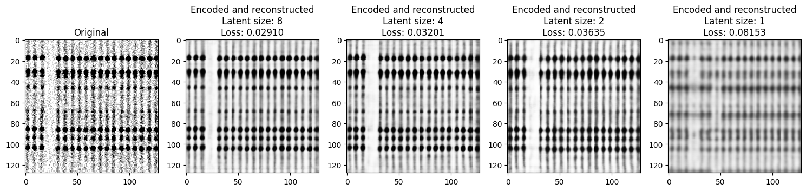

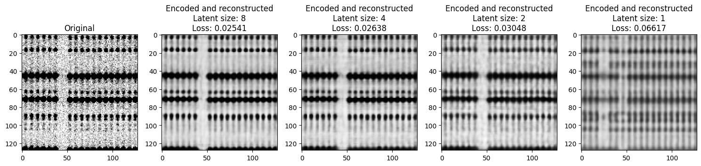

_Looked at the $\ell = 2$ latent space_ — Just a scatter plot of the embedding space reveals two large clusters, which correspond exactly to red or blue. I also plotted the scatter plots against a bunch of other quantities, but didn't see any super clear correlations. As a summary of those exercises, I plotted the Pearson correlation coefficient between each metadata column and each latent dimension.

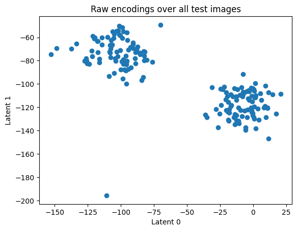
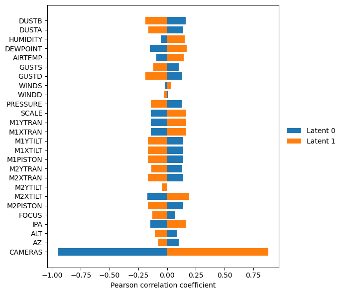

*Learned the $\ell = 2$ latent space* — Since we're able to produce decent reconstructions with $\ell = 2$ and it seems like there might be exploitable correlations there, I decided to try predictive modeling with the embeddings. To start simple, I just used linear regression where the inputs are ~25 metadata variables and the outputs are the 2D embeddings.(No reference arc images/embeddings/metadata, like we talked about doing.) Since the model outputs predicted embeddings, I then put those through the decoder to produce predicted arc images.

Numerically, the performance looked about like this:

| | Train MSE | Test MSE |
| --- | --- | --- |
| Autoencoder ($\ell = 2$) | 0.0367 | 0.0353 |
| Decoded predictions from metadata | 0.0610 | 0.0637 |

So, we're not doing _great_, but the performance here generalizes from train to test _and_ still beats the $\ell = 1$ autoencoder.

Here's some sample images from the test set.

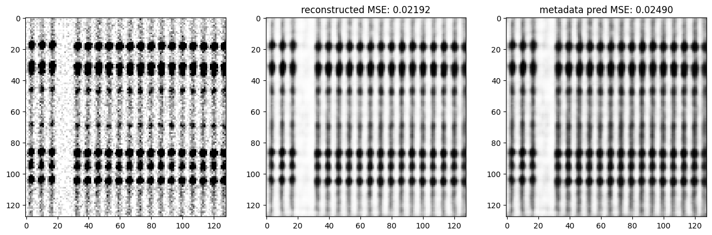
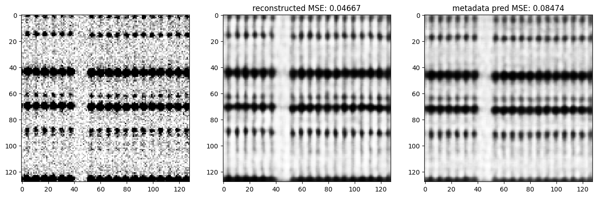
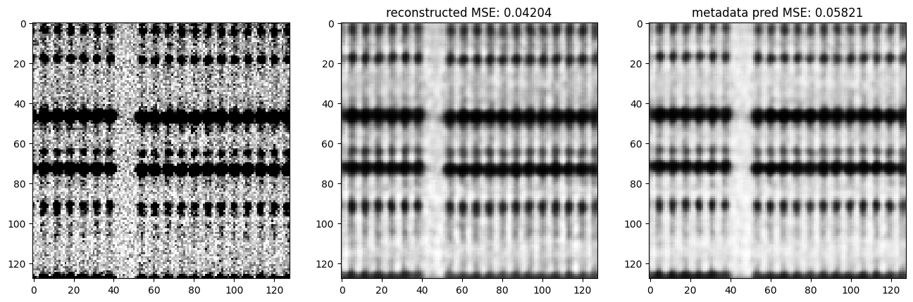
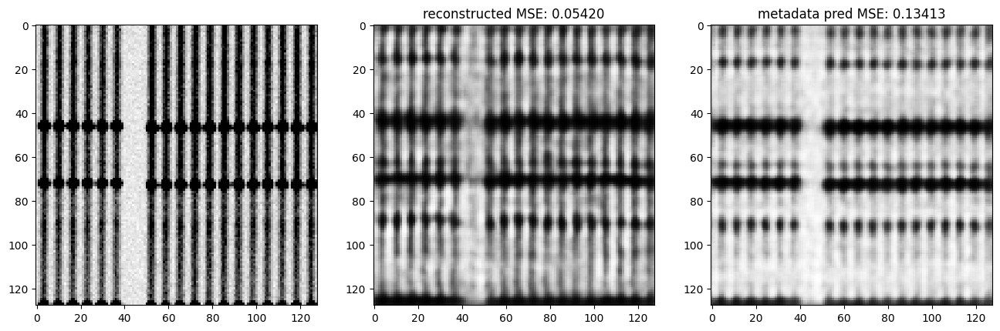

("Reconstructed" means just run through the autoencoder. "Predicted" means embedding predicted from metadata and decoded into image.)

## Questions and next steps

I'm trying to decide what to focus on next. Should I...
- work on using larger chunks from the images?
- explore the predictive modeling with higher dimensional embeddings? more sophisticated models?
- download more data and keep training?
- mess with autoencoder architecture to try to improve low-dim embeddings?
- something else?

_Update after discussions with Hogg, Blanton_

Some known issues that I'm working on fixing:
- Training on images from cameras at once is a bad idea; training separate models for each camera allows us to learn each camera's latent calibration state, which makes more sense.
- The current data preprocessing pipeline places a cut on the max pixel value, which I've been told is a terrible idea and throws away important data. I'm working on replacing the data calibration pipeline with one that does _not_ do this.

